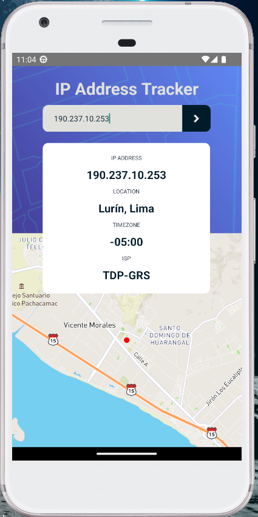

<h1 align="center">IP TRACKER APP</h1>
<h6 align="center">App to get ip geolocalization</h6>

<div align="center"></div>


1. Bootstrapped with [React Native](https://reactnative.dev/).

## 👾 Set Up

1. Install the dependencies

    ```sh
    yarn install
    ```

2. Start development server

    ```sh
    # should install android studio and JDK11, also create
    # Pixel_XL_API_33 device and set
    # emulator commando in the PATH

    emulator -avd Pixel_XL_API_33
    ```

    ```sh
    npm run start
    ```

    ```sh
    npm run androind
    ```

## 👾 Build and Run for production
1. Generate a full static production build

    ```sh
    npx react-native run-android --mode=release

    # when is BUILD SUCCESFULL you can exit console
    ```

2. Get APK:

  - then, you can share and install the apk generated in:
    ```
    \android\app\build\outputs\apk\release\app-release.apk
    ```


### 🛠 Built with

- [React Native](https://reactnative.dev/)
- Typescript
- Mapbox

### 💻 Author

- Portfolio - [@newtyf](https://newtyf.com)
- Instagram - [@newtyf](https://www.instagram.com/newt_yf/)
- LinkedIn - [@newtyf](https://www.linkedin.com/in/axel-mu%C3%B1oz/)
- Frontend Mentor - [@newtyf](https://www.frontendmentor.io/profile/TREz-bits)